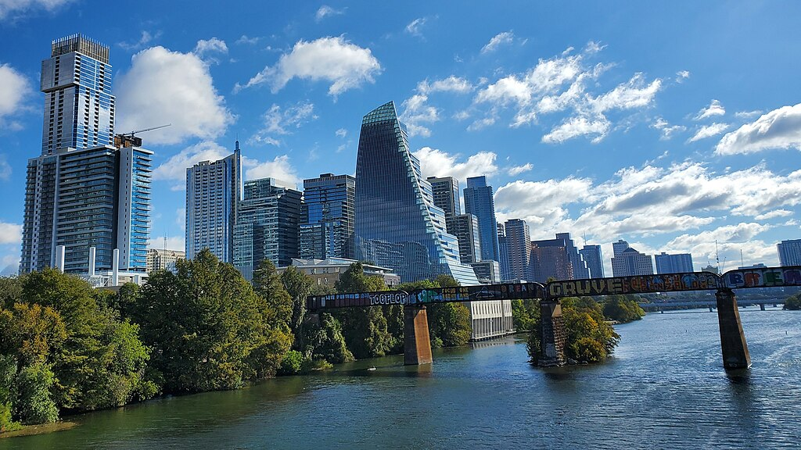
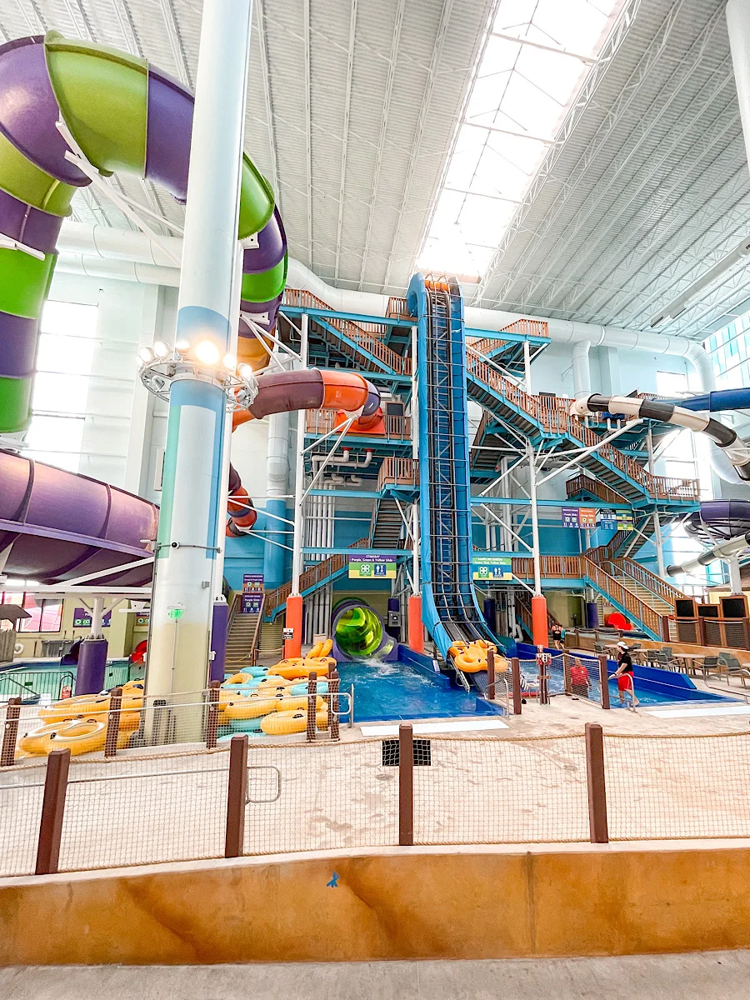

+++
Title = 'Kalahari Resorts/Austin'
date = 2024-01-14T07:07:07+01:00
draft = false
+++

* **Location**: Round Rock, TX - 2.5h drive - 170mi
* [Website](https://www.kalahariresorts.com/texas)
* [Park maps](https://www.kalahariresorts.com/media/uarmokui/tx-waterpark-map-11x17-060123.pdf)
* Opened in November, 2020.

Downtown Austin

## Indoor Waterpark

Open all year.

Note that it is indoor, which can be particularly valuable during peak summer. 

[List of slides](https://mommymouseclubhouse.com/kalahari-resort-texas-review/):

* **Barrelling Baboon** - A two or four-person family raft slide
* **Kenya Korkscrew** - A tandem one or two-person slide
* **Rippling Rhino** - A slide for one or two riders. Must be 48″ to ride alone.
* **Serengeti Spinner** - A one or two-person slide featuring 360 degree spins.
* **Stingray** - A two or four-person extreme family raft slide
* **Swahili Swirl** - A one or two-person slide featuring a funnel.
* **The Smoke That Thunders** - A two or four-person family raft slide
* **Wild Wildebeast** - A one or two-person tube slide.

## Outdoor Waterpark

Opens in March.

## Tom Foolerys Adventure Park

Massive indoor play area.  Includes a bunch of rides and an arcade.

[Listing of all rides and attractions](https://www.kalahariresorts.com/texas/parks-and-passes/tom-foolerys/)

## Pricing

* Tom Foolery: $45/each, Colin is free, arcade is extra
* Indoor waterpark: $50/each
* On-site hotel: $600/night, waterparks included in rate

## Austin

Of course there is tons to do in Austin:

* [Barton Springs Pool](https://www.austintexas.gov/department/barton-springs-pool)
* Purrfecto Cat Lounge
* Central Library
* Austin Nature and Science Center
* Lake Austin Riverboat
* The Dirdie Birdie (Mini Golf)
* Bat watching
* Austin Aquarium
* Austin Zoo
* [Thinkery](https://thinkeryaustin.org), a STEAM museum for children
* Bowling
* [Alliance Children's Garden](https://www.austintexas.org/listings/alliance-childrens-garden/13505/)

And I'm sure there's plenty of food options!

## Possible Schedule

* **Sunday**: Travel to Austin, stay off-site
* **Monday**: Breakfast in Austin, check in to Kalahari, play all day
* **Tuesday**: Kalahari
* **Wednesday**: Check out of Kalahari, play all day, check in at hotel in Austin
* **Thursday**: Thinkery, park
* **Friday**: Open
* **Saturday**: Home
