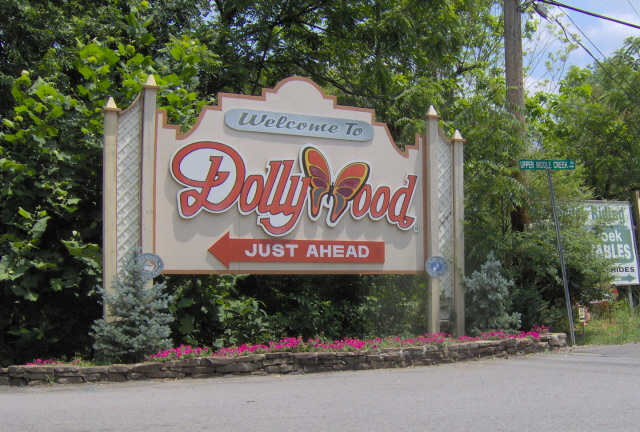
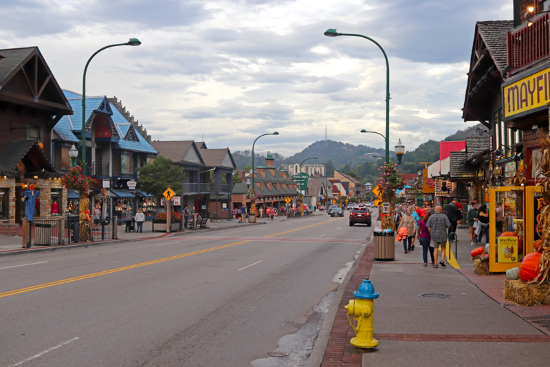

+++
Title = 'Dollywood'
date = 2024-01-14T07:07:07+01:00
draft = false
+++

**Distance**: 900mi, ~13 hours

## Why Dollywood?

* Lots of fun for kids
* Tennessee has a lot of nature to offer
* Could make scenic stops in Little Rock, Memphis, or Nashville
* Could plan a meet up with Tim and Stephanie!
* Driveable - able to have our car as a home base.

## Why NOT Dollywood?

* Really far - would likely take two days to drive just one way
* We love Dolly Parton, but wer're not exactly superfans.
* There's likely another great kid-oriented theme park closer to home
* Would deal with the trappings of any theme park in the summer
* Our two younger kids are a bit young for the theme park

## Attractions

### Smoky Mountain Summer Celebration

June 15 - August 11

* Done & fireworks show
* Bubble show

### Splash Country

May 11 - September 15

Water park adjacent to the main Dollywood park.

* Splash zone
* Family innertube slide
* Float trip
* Fire Tower Falls: steep water slide
* Splash pad
* More water slides
* Wave pool
* So many slides

### [Gatlinburg](https://www.gatlinburg.com)

"The Mountains Are Calling"

Gatlinburg is ~5mi from Dollywood.

Attractions:

* Gondola
* Mountain coaster
* Space Needle
* Aquarium
* Shopping
* Food

### Cabins

Cabins seems to be the preferred lodging for Dollywood visitiors.
There is a whole section of the Dollywood website devoted to them.

Expect to spend $3,000-4,000 for a good cabin experience.

I personally would enjoy staying in a cabin,
further embracing the outdoorsy Smoky Mountain aesthetic.

### [Theme Park](https://www.dollywood.com/themepark/rides/)

Typical theme park faire: lots of:

* Roller coasters
* Kids rides
* Food
* Dolly memorabilia
* Playgrounds
* Shows
* Crafts

There's also live bird viewings (eagles, etc).

3 day pass for family: **$700**

| | |
|------|------|
|||
|||
|||
|||

## Potential Schedule

* Day 1: Memphis
* Day 2: Gatlinburg
* Day 3: Dollywood
* Day 4: Water Park
* Day 5: Dollywood
* Day 6: Nashville
* Day 7: Little Rock/Home
