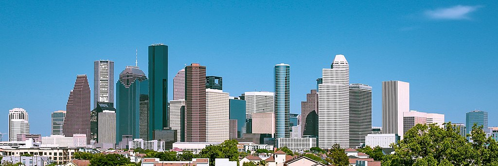
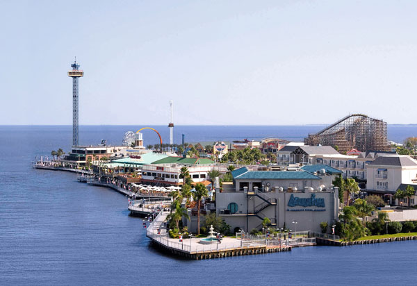

+++
title = 'Houston Vacation'
date = 2024-01-14T07:07:07+01:00
draft = false
+++

# Houston

**Distance**: 360mi, ~3h 45m drive

## Why Houston?

* Easy drive
* Tons to do - big city
* Close to beach
* Decent urban core - perhaps won't have to drive

## Why NOT Houston?

* Super humid - armpit of Texas
* Traffic will be miserable (but won't it be bad everywhere?)
* Lack of really unique experiences - why not just go to Dallas for the "big city" experience?

## Getting Around

Houston is notorious for its massive highways, so we will undoubtedly be in the car often.

That said, staying in a hotel downtown and choosing activities nearby *could* allow us to ditch the car a couple of the days.

Houston does have [public transit](https://www.ridemetro.org).  The bus routes go pretty much everywhere, but the rail lines are very limited, only going to the museum district.

## Hotels

### Marriott Marquis

This hotel is right downtown and has the fancy lazy river on its roof.

**Price**: $481/room/night x 5 nights x 2 rooms = $4,810

### Hampton Inn

Downtown, but much cheaper.

**Price**: $238/room/night x 5 nights x 2 rooms = $2,380

### Crowne Plaza

Even cheaper, but not downtown.  It's near the intersection of I-10 (Katy Freeway) and I-610.

**Price**: $136/room/night x 5 nights x 2 rooms = $1,360

## Attractions

### Astros game
While we aren't baseball fans, this would be a fun outing that the kids would likely enjoy, just for the food and atmosphere.

**Location**: Minute Maid Park, Northwest downtown

### [Buffalo Bayou Park](https://buffalobayou.org/location/buffalo-bayou-park/)
It's a park on the Buffalo Bayou (a kind of river?).  Nothing that seems extraordinary about the park, but it's a nice one.

**Location**: 2.5 miles west of downtown

## Memorial Park

Another park, but it's huge.
There is a [conservation group][1] that seems to promote and preserve its natural beauty.
Biking, skating, all the typical park activities.

**Location**: 5.4 miles west of downtown

[1]: https://buffalobayou.org/location/buffalo-bayou-park/

### [Discovery Green](https://www.discoverygreen.com)

Downtown park (southeast end).  Has a small lake and does kayaking.

### Hines Waterfall Park

Yet another urban park, but this time a big waterfall.

### [Houston Arboretum](https://houstonarboretum.org)

Lots of children's programs.

**Location**: 5.5 miles west of downtown, right next to Memorial Park

### Marriott Marquis Lazy River

On top of the Marriott Marquis building in downtown Houston.
Can buy day passes Monday-Thursday, but only available to hotel guests otherwise.

### [Houston Museum District](https://houmuse.org)
20 museums, 4 walkable zones, including a children's museum.  Very close to the zoo.

**Location**: 3.5 miles southwest of downtown

### [Houston Zoo](https://www.houstonzoo.org)

**Location**: 4 miles southwest of downtown

### Miller Outdoor Theatre
### Boat Tours

### Galveston

We all know and love Galveston beaches, but we haven't done much in the city.
There are likely lots of things to do in Galveston itelsef,
at least enough to make it a day trip.

### [Space Center Houston](https://spacecenter.org)

Popular attraction for kids, though a bit expensive.

**Price**: $25/kid (4-11), $30/adult, $28/senior.  Total: **$138 + tax**

**Location**: 30 min from downtown Houston.  About halfway between downtown and Galveston.

### Kemah Boardwalk

This is the boardwark at Galveston beach.
There are a bunch of rides for kids and adults, priced at $6.50 per person per ride.
Also a bunch of resaurants, a playground and an arcade.

