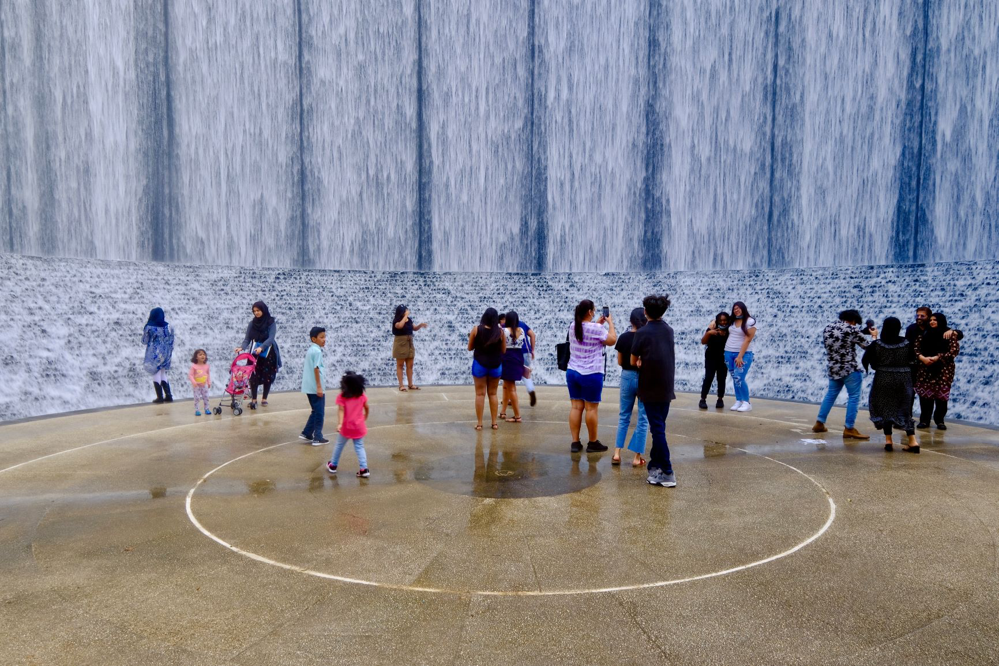
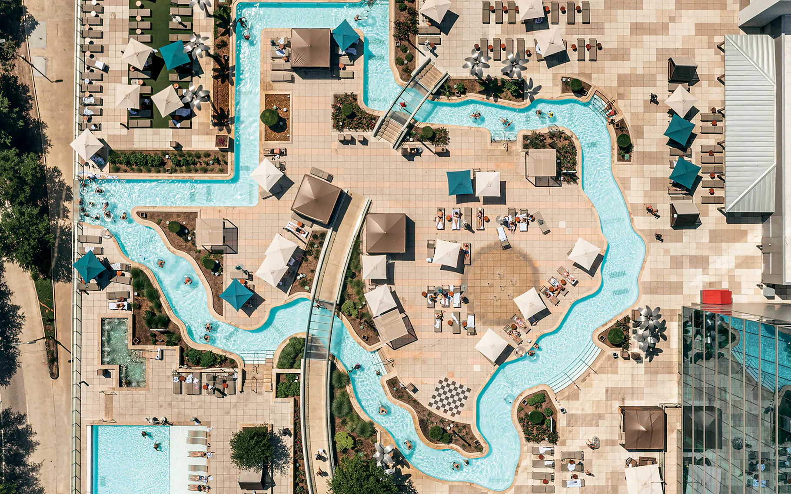

+++
title = 'Houston Vacation'
date = 2024-01-14T07:07:07+01:00
draft = false
+++

# Houston

## Destinations

### Astros game
While we aren't baseball fans, this would be a fun outing that the kids would likely enjoy, just for the food and atmosphere.

**Location**: Minute Maid Park, Northwest downtown

### [Buffalo Bayou Park](https://buffalobayou.org/location/buffalo-bayou-park/)
It's a park on the Buffalo Bayou (a kind of river?).  Nothing that seems extraordinary about the park, but it's a nice one.

**Location**: 2.5 miles west of downtown

## Memorial Park
Another park, but it's huge.  There is a [conservation group](https://buffalobayou.org/location/buffalo-bayou-park/) that seems to promote and preserve its natural beauty.  Biking, skating, all the typical park activities.

**Location**: 5.4 miles west of downtown

### [Discovery Green](https://www.discoverygreen.com)

Downtown park (southeast end).  Has a small lake and does kayaking.
### Hines waterfall park

Yet another urban park, but this time with waterfalls.

### [Houston arboretum](https://houstonarboretum.org)

Lots of children's programs.

**Location**: 5.5 miles west of downtown, right next to Memorial Park

### Marriott marquis lazy river
On top of the Marriott Marquis building in downtown Houston.
Can buy day passes Monday-Thursday, but only available to hotel guests otherwise.

### [Houston museum district](https://houmuse.org)
20 museums, 4 walkable zones, including a children's museum.  Very close to the zoo.

**Location**: 3.5 miles southwest of downtown

### [Houston zoo](https://www.houstonzoo.org)

**Location**: 4 miles southwest of downtown

### Miller outdoor theatre
### Houston space center
### Galveston
### Kemah boardwalk
### Boat tours
